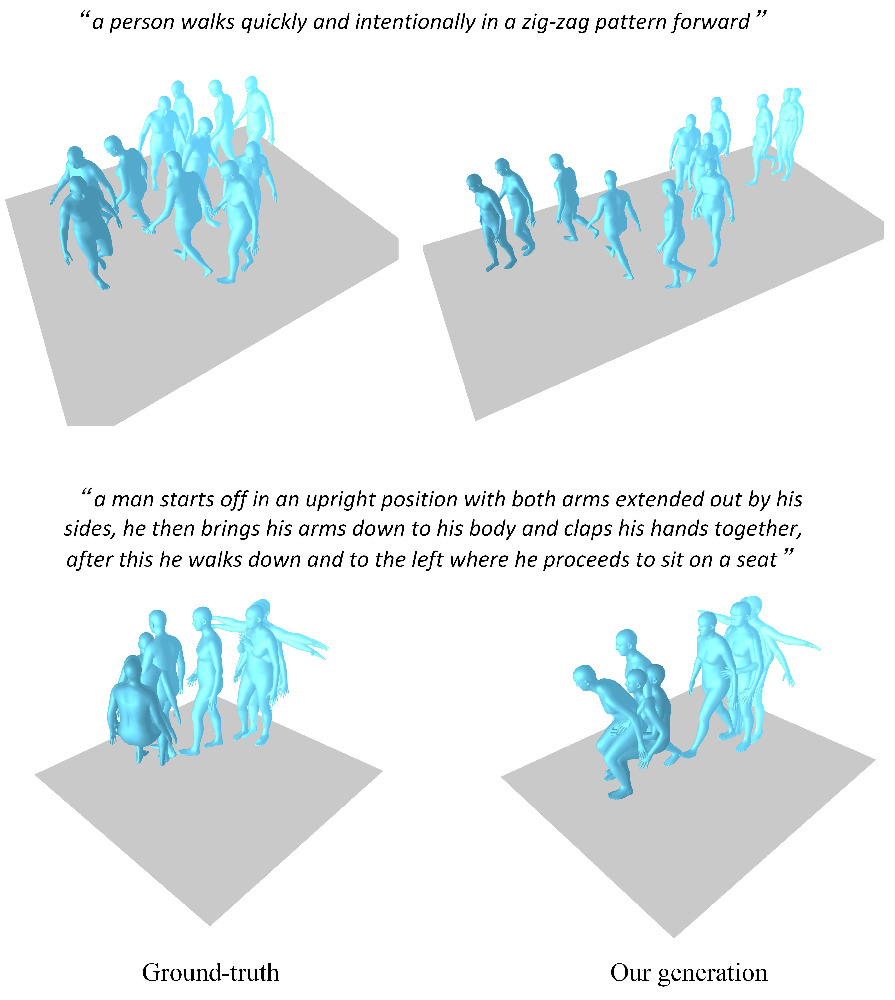
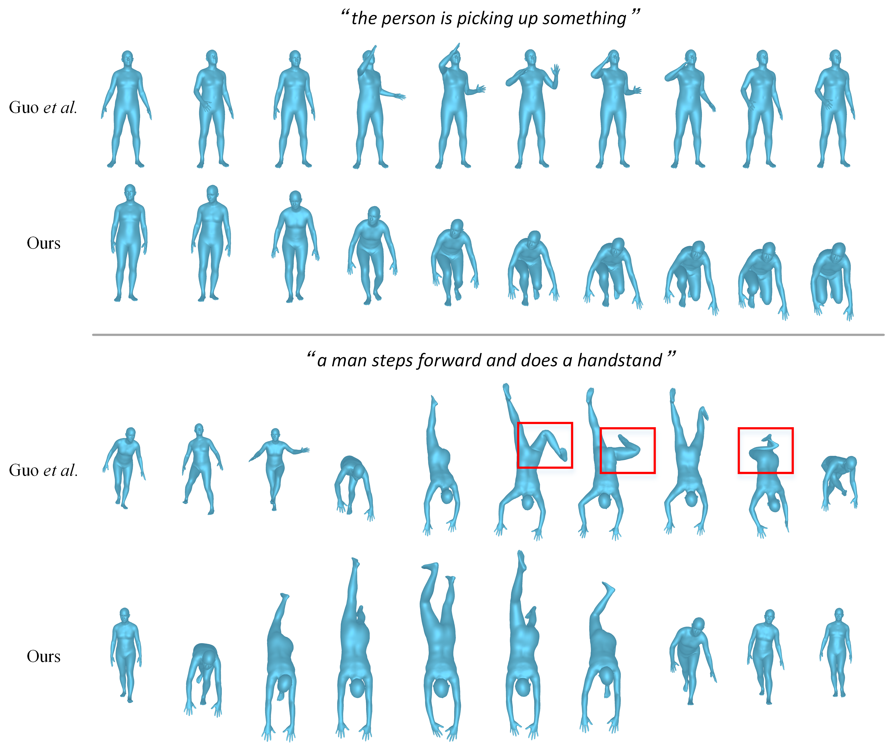
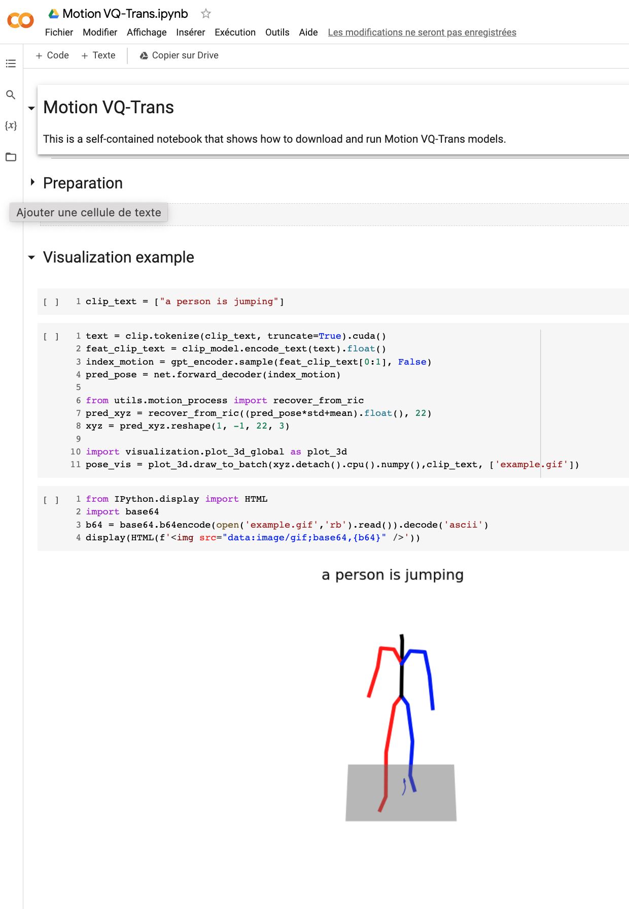

# Motion VQ-Trans
Pytorch implementation of paper "Generating Human Motion from Textual Descriptions with High Quality Discrete Representation"


[[Notebook Demo]](https://colab.research.google.com/drive/1tAHlmcpKcjg_zZrqKku7AfpqdVAIFrF8?usp=sharing)




If our project is helpful for your research, please consider citing : (todo)
``` 
@inproceedings{shen2020ransac,
          title={RANSAC-Flow: generic two-stage image alignment},
          author={Shen, Xi and Darmon, Fran{\c{c}}ois and Efros, Alexei A and Aubry, Mathieu},
          booktitle={16th European Conference on Computer Vision}
          year={2020}
        }
```


## Table of Content
* [1. Visual Results](#1-visual-results)
* [2. Installation](#2-installation)
* [3. Quick Start](#3-quick-start)
* [4. Train](#4-train)
* [5. Evaluation](#5-evaluation)
* [6. Motion Render](#6-motion-render)
* [7. Acknowledgement](#7-acknowledgement)
* [8. ChangLog](#8-changlog)


## 1. Visual Results (More results can be found in our project page (todo))



 
## 2. Installation

### 2.1. Environment

<!-- Our model can be learnt in a **single GPU GeForce GTX 1080Ti** (12G).

Install Pytorch adapted to your CUDA version : 

* [Pytorch 1.2.0](https://pytorch.org/get-started/previous-versions/#linux-and-windows-1) 
* [Torchvision 0.4.0](https://pytorch.org/get-started/previous-versions/#linux-and-windows-1)

Other dependencies (tqdm, visdom, pandas, kornia, opencv-python) : 
``` Bash
bash requirement.sh
``` -->

Our model can be learnt in a **single GPU V100-32G**

```bash
conda env create -f environment.yml
conda activate VQTrans
```

The code was tested on Python 3.8 and PyTorch 1.8.1.


### 2.2. Dependencies

```bash
bash dataset/prepare/download_glove.sh
```


### 2.3. Datasets


We are using two 3D human motion-language dataset: HumanML3D and KIT-ML. For both datasets, you could find the details as well as download link [[here]](https://github.com/EricGuo5513/HumanML3D).   

Take HumanML3D for an example, the file directory should look like this:  
```
./dataset/HumanML3D/
├── new_joint_vecs/
├── texts/
├── Mean.npy # same as in [HumanML3D](https://github.com/EricGuo5513/HumanML3D) 
├── Std.npy # same as in [HumanML3D](https://github.com/EricGuo5513/HumanML3D) 
├── train.txt
├── val.txt
├── test.txt
├── train_val.txt
└──all.txt
```


### 2.4. Motion & text feature extractors:

We use the same extractors provided by [t2m](https://github.com/EricGuo5513/text-to-motion) to evaluate our generated motions. Please download the extractors.

```bash
bash dataset/prepare/download_extractor.sh
```

### 2.5. Pre-trained models 

The pretrained model files will be stored in the 'pretrained' folder:
```bash
bash dataset/prepare/download_model.sh
```

<!-- Quick download : 

``` Bash
cd model/pretrained
bash download_model.sh
```

For more details of the pre-trained models, see [here](https://github.com/XiSHEN0220/RANSAC-Flow/blob/master/model/pretrained)  -->

### 2.6. Render motion (optional)

If you want to render the generated motion, you need to install:

```bash
sudo sh dataset/prepare/download_smpl.sh
conda install -c menpo osmesa
conda install h5py
conda install -c conda-forge shapely pyrender trimesh mapbox_earcut
```


## 3. Quick Start

A quick start guide of how to use our code is available in [demo.ipynb](https://colab.research.google.com/drive/1tAHlmcpKcjg_zZrqKku7AfpqdVAIFrF8?usp=sharing)

<p align="center">

</p>


## 4. Train

Note that, for kit dataset, just need to set '--dataname kit'.

### 4.1. VQ-VAE 

The results are saved in the folder output_vqfinal.

<details>
<summary>
VQ training
</summary>

```bash
python3 train_vq.py \
--batch-size 256 \
--lr 2e-4 \
--total-iter 300000 \
--lr-scheduler 200000 \
--nb-code 512 \
--down-t 2 \
--depth 3 \
--dilation-growth-rate 3 \
--out-dir output \
--dataname t2m \
--vq-act relu \
--quantizer ema_reset \
--loss-vel 0.5 \
--recons-loss l1_smooth \
--exp-name VQVAE
```

</details>

### 4.2. Motion-Transformer 

The results are saved in the folder output_transformer.

<details>
<summary>
MoTrans training
</summary>

```bash
python3 train_t2m_trans.py  \
--exp-name VQTransformer \
--batch-size 128 \
--num-layers 9 \
--embed-dim-gpt 1024 \
--nb-code 512 \
--n-head-gpt 16 \
--block-size 51 \
--ff-rate 4 \
--drop-out-rate 0.1 \
--resume-pth output/VQVAE/net_last.pth \
--vq-name VQVAE \
--out-dir output \
--total-iter 300000 \
--lr-scheduler 150000 \
--lr 0.0001 \
--dataname t2m \
--down-t 2 \
--depth 3 \
--quantizer ema_reset \
--eval-iter 10000 \
--pkeep 0.5 \
--dilation-growth-rate 3 \
--vq-act relu
```

</details>

## 5. Evaluation 

### 5.1. VQ-VAE 
<details>
<summary>
VQ eval
</summary>

```bash
python3 VQ_eval.py \
--batch-size 256 \
--lr 2e-4 \
--total-iter 300000 \
--lr-scheduler 200000 \
--nb-code 512 \
--down-t 2 \
--depth 3 \
--dilation-growth-rate 3 \
--out-dir output \
--dataname t2m \
--vq-act relu \
--quantizer ema_reset \
--loss-vel 0.5 \
--recons-loss l1_smooth \
--exp-name TEST_VQVAE \
--resume-pth output/VQVAE/net_last.pth
```

</details>

### 5.2. Motion-Transformer

<details>
<summary>
MoTrans eval
</summary>

```bash
python3 GPT_eval_multi.py  \
--exp-name TEST_VQTransformer \
--batch-size 128 \
--num-layers 9 \
--embed-dim-gpt 1024 \
--nb-code 512 \
--n-head-gpt 16 \
--block-size 51 \
--ff-rate 4 \
--drop-out-rate 0.1 \
--resume-pth output/VQVAE/net_last.pth \
--vq-name VQVAE \
--out-dir output \
--total-iter 300000 \
--lr-scheduler 150000 \
--lr 0.0001 \
--dataname t2m \
--down-t 2 \
--depth 3 \
--quantizer ema_reset \
--eval-iter 10000 \
--pkeep 0.5 \
--dilation-growth-rate 3 \
--vq-act relu \
--resume-gpt output/VQTransformer/net_best_fid.pth
```

</details>


## 6. Motion Render 

<details>
<summary>
Motion Render
</summary>

You should input the npy folder address and the motion names. Here is an example:

```bash
python3 render_final.py --filedir output/TEST_VQTransformer/ --motion-list 000019 005485
```

</details>

### 7. Acknowledgement

We appreciate helps from :  

* Public code like [text-to-motion](https://github.com/EricGuo5513/text-to-motion), [TM2T](https://github.com/EricGuo5513/TM2T) etc.

### 8. ChangLog


<!-- # VQGPT

```
# VQ during training OT
/apdcephfs_cq2/share_1290939/jirozhang/anaconda3/envs/motionclip/bin/python3 train_251_cnn_all.py \
--batch-size 128 \
--exp-name xxxxxx \
--lr 2e-4 \
--total-iter 300000 \
--lr-scheduler 200000 \
--nb-code 512 \
--down-t 2 \
--depth 5 \
--out-dir /apdcephfs_cq2/share_1290939/jirozhang/VQCNN_HUMAN/ \
--dataname t2m \
--vq-act relu \
--quantizer ot \
--ot-temperature 1 \
--ot-eps 0.5 \
--commit 0.001 \
```

```
# VQ251 training baseline
/apdcephfs_cq2/share_1290939/jirozhang/anaconda3/envs/motionclip/bin/python3 train_251_cnn_all.py \
--batch-size 128 \
--exp-name VQ263_300K_512cb_down4_t2m_ema_relu_test \
--lr 2e-4 \
--total-iter 300000 \
--lr-scheduler 200000 \
--nb-code 512 \
--down-t 2 \
--depth 5 \
--out-dir /apdcephfs_cq2/share_1290939/jirozhang/VQCNN_HUMAN/ \
--dataname t2m \
--vq-act relu \
--quantizer ema \
```


```bash
# gpt training + noise
/apdcephfs_cq2/share_1290939/jirozhang/anaconda3/envs/motionclip/bin/python3 train_gpt_cnn_noise.py  \
--exp-name GPT_VQ_300K_512cb_down4_t2m_ema_relu_bs128_ws64_fid_mask1_08 \
--batch-size 128 \
--num-layers 4 \
--block-size 51 \
--n-head-gpt 8 \
--ff-rate 4 \
--drop-out-rate 0.1 \
--resume-pth output_vqhuman/VQ_300K_512cb_down4_t2m_ema_relu_bs128_ws64/net_best_fid.pth \
--vq-name VQ_300K_512cb_down4_t2m_ema_relu_bs128_ws64_fid_mask1_08 \
--total-iter 300000 \
--lr-scheduler 150000 \
--lr 0.0001 \
--if-auxloss \
--dataname t2m \
--down-t 2 \
--depth 5 \
--quantizer ema \
--eval-iter 5000 \
--pkeep 0.8
```


### Visualize VQ (Arch Taming) in HTML 

* Generate motion. This will save generated motions in `./visual_results/vel05_taming_l1s`

```
python vis.py --dataname t2m --resume-pth /apdcephfs_cq2/share_1290939/jirozhang/VQ_t2m_bailando_relu_NoNorm_dilate3_vel05_taming_l1s/net_last.pth --visual-name vel05_taming_l1s --vis-gt --nb-vis 20
```

* Make a Webpage. Go to visual_html.py, modify the name, then run :

```
python visual_html.py
``` -->
